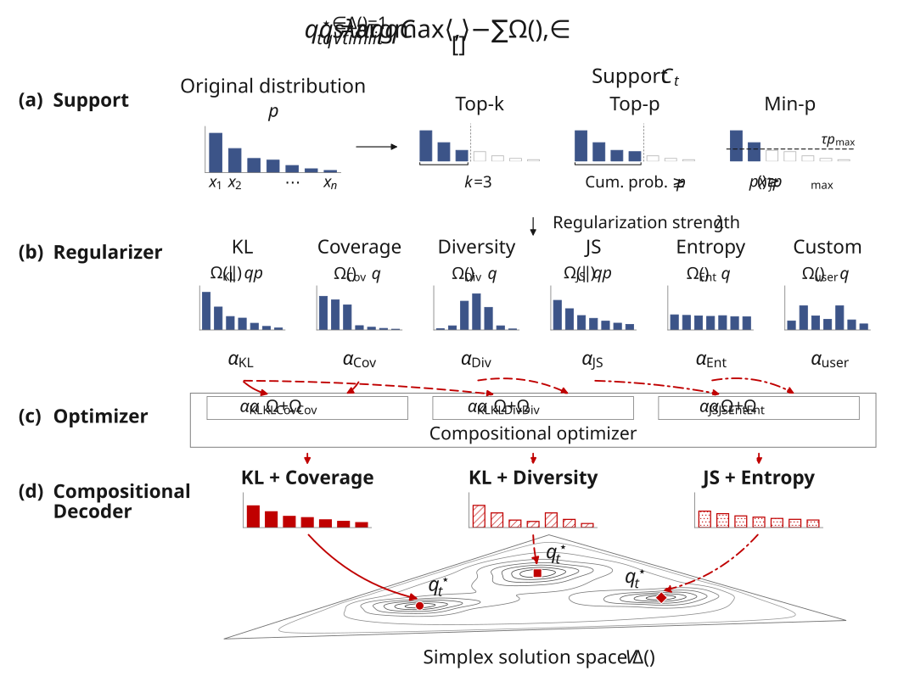

# CompoSimplex

*Composable Decoding on the Probability Simplex: Theory and Implementation*

[](https://arxiv.org/abs/2609.34992)



## About

CompoSimplex treats language-model decoding as an optimization problem. Instead of applying a fixed sampling rule, each generation step solves for the next-token distribution

```math
q_t^\star = \arg\max_{q \in \Delta(S_t)} \Big[ \langle q, s_t \rangle - \lambda \sum_{i=1}^{m} \alpha_i \, \Omega_i(q) \Big]
```

where $s_t$ are the model's logits, $S_t$ is the set of candidate tokens, and each $\Omega_i$ is a regularizer that shapes the distribution.

- Greedy, temperature, Top-k and Top-p sampling are all special cases.
- New decoders are built by mixing regularizers in a YAML config.
- Works with Hugging Face Transformers and vLLM.

The paper's **Best-of-K** decoder is KL + Coverage (or KL + Diversity).


## Installation

From the repository root:

```bash
pip install -e .
```

For benchmarks, install the dataset and evaluation dependencies:

```bash
pip install -e ".[benchmark]"
```

IFEval dataset also needs `pip install -e '.[ifeval]'`, and LiveCodeBench dataset needs its
[official grader](https://github.com/LiveCodeBench/LiveCodeBench/tree/28fef95ea8c9f7a547c8329f2cd3d32b92c1fa24).

## Supported components

| Component | Available choices |
| --- | --- |
| Support | Full vocabulary, Top-k, Top-p, Min-p, Eta sampling, Typical sampling |
| Regularizer | Kullback–Leibler divergence, Jensen–Shannon divergence, Entropy, Coverage, Diversity |
| Solver | Closed-form solutions, Mirror ascent |
| Token selection | Multinomial sampling, Argmax |
| Backend | Transformers or vLLM |
| Benchmark | MATH500, GPQA Diamond, IFEval, LiveCodeBench v6 |

One starter config is provided for each model:

| Model | Benchmark | Config |
| --- | --- | --- |
| Qwen2.5-7B | MATH500 | [qwen2_5_7b.yaml](benchmark/configs/qwen2_5_7b.yaml) |
| Qwen3-4B-Base | GPQA Diamond | [qwen3_4b_base.yaml](benchmark/configs/qwen3_4b_base.yaml) |
| LFM2.5-1.2B-Base | IFEval | [lfm2_5_1_2b_base.yaml](benchmark/configs/lfm2_5_1_2b_base.yaml) |
| Gemma-4-26B-A4B-IT | LiveCodeBench v6 | [gemma4_26b_a4b_it.yaml](benchmark/configs/gemma4_26b_a4b_it.yaml) |

## Quick start: define and evaluate a decoder

Define a decoder by creating a model's YAML file: select a support, combine
regularizers, and choose a solver. The same benchmark command generates
completions and evaluates the resulting decoder.

```yaml
sampler:
  temperature: 0.5
  max_new_tokens: 3072
  support: {type: topm, value: 200}
  base_distribution: {type: softmax, temperature: 1.0}
  lambda: 1.0
  solver: auto
  optimizer: {name: mirror_ascent, steps: 10, lr: 0.1, tol: 0.0}
  regularizers:
    - {type: kl_to_base, alpha: 0.5}
    - {type: coverage, alpha: 0.5, K: 16, weight_mode: topm_l2, top_m: 8}

run:
  seed: 0
  max_examples: 2
  num_samples: 2
  output_dir: results/quickstart/kl_coverage/{backend}
```

To customize this decoder further, change the support to
`{type: minp, min_p: 0.05, temperature: 0.5}`, replace Coverage with Entropy,
or add another regularizer. `lambda` controls the overall strength;
the `alpha` weights sum to 1 and control each regularizer's share.

Then generate and evaluate with one command:

```bash
python benchmark/run.py --config benchmark/configs/qwen2_5_7b.yaml
```

The default backend is Transformers; with vLLM supported, add `--backend vllm`.


Metrics and completions are saved under `run.output_dir`. Give each decoder
configuration a new output directory so its results stay separate.

## Code layout

```text
composimplex/
├── src/composimplex/
│   ├── config.py             Configuration and component construction
│   ├── supports.py           Candidate-token support rules
│   ├── regularizers.py       Composable objective primitives
│   ├── solvers.py            Simplex optimization
│   ├── sampler.py            Distribution construction and token sampling
│   ├── metrics.py            Distribution-level metrics
│   └── integrations/
│       ├── transformers.py
│       └── vllm.py
├── benchmark/
│   ├── configs/              One starter config per model
│   ├── run.py                Generation and benchmark entry point
│   ├── grader.py             Correctness and instruction-following graders
│   ├── utils.py              Data, prompts, and metric aggregation
│   └── evaluate.py           Saved-output metrics
├── docs/overview.svg         Framework diagram
└── pyproject.toml
```

## Citation

```bibtex
@misc{ji2026composabledecodingprobabilitysimplex,
      title={Composable Decoding on the Probability Simplex: Theory and Implementation}, 
      author={Xiaotong Ji and Ahmed Khaled Khamis and Rasul Tutunov and Matthieu Zimmer and Haitham Bou-Ammar},
      year={2026},
      eprint={2609.34992},
      archivePrefix={arXiv},
      primaryClass={cs.LG},
      url={https://arxiv.org/abs/2609.34992}, 
}
```